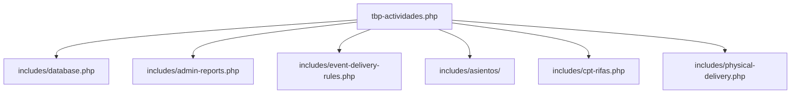

# Documentación Técnica Completa: TBP - Actividades (v11.9.75)

Este documento sirve como memoria técnica, mapa arquitectónico y manual de operaciones del plugin **The Best Prom - Actividades**. Su propósito es resumir todas las funcionalidades, flujos de datos críticos, integraciones con *Event Tickets Plus*, ganchos de WooCommerce y el nuevo módulo de **Asignación de Asientos** para guiar futuras iteraciones sin pérdida de contexto.

---

## 1. Arquitectura y Módulos Principales

El plugin se estructura en módulos especializados ubicados en la carpeta `includes/`:

*   **`tbp-actividades.php`**: Inicialización del plugin, carga de dependencias, definición del changelog en comentarios de cabecera, hooks generales de WordPress y rutinas de migración.
*   **`includes/database.php`**: Estructura de tablas de la base de datos (logs de entregas locales).
*   **`includes/admin-reports.php`**: Reporte administrativo general en WP-Admin optimizado para HPOS usando DataTables (Server-Side) y exportación a XLSX/CSV.
*   **`includes/event-delivery-rules.php`**: Gestión de reglas de entrega física por fechas y productos (sincronización con QR de Event Tickets).
*   **`includes/cpt-rifas.php` y `cpt-premiaciones.php`**: Custom Post Types para sorteos, tómbolas y premiaciones.
*   **`includes/asientos/`**: Módulo avanzado de asignación de asientos y planos interactivos por lotes y grupos.
*   **`includes/physical-delivery.php` y `physical-management.php`**: Front-end y shortcodes para la gestión e historial del cliente.

---

## 2. Módulo: Asignación de Asientos (Asientos-Engine)

Este módulo (ubicado en `includes/asientos/`) permite diseñar planos interactivos de mesas y asignar asientos a los asistentes de un evento agrupándolos de forma automática o manual.

### 2.1 Flujo UX en 3 Etapas (Wizard)
El panel de administración se divide en tres pestañas que guían al usuario en el proceso:

1.  **Etapa 1: Configuración de Metadatos**: Selección del evento, proveedor de mesas (ej. Cintermex), clave de metadatos que define los grupos (ej. `Grupo` o `Talla`) y filtrado de cantidades.
2.  **Etapa 2: Procesamiento del Plano**: Diseño del plano interactivo del salón (filas, columnas, zonas, mesas, y capacidad PAX).
    *   *Corrección Clave (v11.9.65)*: Se restauró el campo de **"Lugares por Mesa (PAX)"** en el generador automático de planos para prevenir que las mesas se crearan con capacidad 0 o NaN (lo que causaba asignaciones erróneas de "PAX 0").
3.  **Etapa 3: Generación y Asignación (Mesa y Plano)**: Visualización del listado de asistentes escaneados y el mapa de mesas para la asignación manual y automatizada.

---

### 2.2 Optimizaciones y Soluciones Críticas del Módulo de Asientos

#### A. Resolución de Carga Lenta del Plano en Eventos Masivos (v11.9.68)
*   **Problema**: Al cargar eventos masivos (como la Prepa 15 con más de 800 asistentes y docenas de mesas), el plano interactivo de Stage 3 se congelaba o tardaba mucho en renderizar debido a la manipulación masiva del DOM elemento por elemento en JS.
*   **Solución**: Se optimizó la renderización en JS generando **cadenas de HTML completas (HTML strings)** en memoria y realizando una sola inserción masiva en el DOM en lugar de múltiples llamadas `appendChild()`. Esto redujo el tiempo de carga del plano de varios segundos a milisegundos.

#### B. Evitar Errores 403 Forbidden al Consolidar Escaneos (v11.9.71)
*   **Problema**: Al escanear eventos con grandes volúmenes de datos (ej. 838 pedidos), la petición AJAX `tbp_asientos_scan_finish` fallaba arrojando un código de error HTTP **403 Forbidden**. Esto ocurría porque el servidor superaba el límite de `max_input_vars` (configurado por seguridad a 1000 variables) al enviar los datos estructurados en formato de lista.
*   **Solución**: Se modificó el JS para serializar los datos usando `JSON.stringify(allResults)` y enviarlos como un solo parámetro de texto plano. En el backend PHP, se decodifica mediante `json_decode()`. De esta forma, sin importar si hay 800 o 5,000 registros, el servidor solo recibe 1 variable de entrada, evadiendo las limitaciones de `max_input_vars`.

#### C. Regla de Herencia de Grupos (v11.9.69)
*   **Problema**: Los asistentes que compraron platillos extra o artículos individuales no venían vinculados a ningún grupo en Event Tickets, apareciendo "sin grupo" en el listado y quedando dispersos.
*   **Solución**: Se implementó una regla de coincidencia: si un asistente no tiene grupo registrado, el escáner busca otros pedidos en el mismo evento que coincidan exactamente con su **mismo correo electrónico de facturación** o **nombre completo** y que sí tengan grupo. Al detectarlo, el asistente "sin grupo" hereda automáticamente el grupo del pedido principal, unificando a las familias y acompañantes en las mismas mesas.

#### D. Filtros de Alta Precisión en Stage 3
*   **Filtro "Cantidad" (v11.9.70)**: Permite segmentar asistentes por número de lugares comprados (1 Lugar, 2 Lugares, etc.). Esto ayuda a ubicar a los alumnos que asisten solos (1 lugar) para agruparlos juntos en mesas exclusivas para estudiantes individuales.
*   **Filtro "Estado" (v11.9.72)**: Permite segmentar el listado por `-- Todos --`, `Ya Asignados` (asistentes con mesa y etiqueta amarilla) y `Falta Asignar` (asistentes pendientes). Facilita limpiar la vista conforme se avanza en el montaje.
*   **Combinación de Filtros**: Los filtros de Cantidad, Estado, Grupo y texto libre son 100% combinables y acumulativos en tiempo real.

#### E. Asignación Manual Selectiva mediante Casillas de Verificación (v11.9.75)
*   **Problema**: Anteriormente, al hacer clic en una mesa, el sistema realizaba una asignación automática secuencial rellenándola con los primeros pedidos pendientes del grupo. El operador no podía elegir de forma individual qué pedidos específicos ubicar en una mesa determinada.
*   **Solución**: Se agregaron casillas de verificación (checkboxes) y control de selección en las filas de pedidos pendientes en la Etapa 3. Al marcar una o varias casillas y hacer clic en una mesa, únicamente los pedidos seleccionados se asignan a esa mesa. Si la capacidad restante de la mesa es insuficiente para acomodar a todos los pedidos seleccionados, se despliega el modal de edición sugiriendo de forma inteligente la capacidad total requerida acumulando los lugares de la selección.

#### F. Robustez e Integridad de AJAX Endpoints (v11.9.66, v11.9.67)
*   Se corrigieron errores fatales de php (`ArgumentCountError`) y endpoints AJAX ausentes:
    *   `tbp_asientos_get_floor_data`: Carga los datos guardados del plano.
    *   `tbp_asientos_manual_assign_batch`: Procesa la asignación masiva de múltiples asistentes a una mesa.
    *   `tbp_asientos_get_scan_data`: Consulta los datos escaneados consolidados.
*   *Resiliencia JS (v11.9.63)*: Se encapsularon e ignoraron las promesas rotas ajenas al plugin (como los avisos de Elementor en el panel de control) que detenían la ejecución de Javascript e impedían interactuar con la pantalla de asientos.

---

### 2.3 Panel de Acciones y Consola de Diagnóstico (v11.9.62)

El metabox derecho de **Acciones** fue rediseñado por completo bajo un paradigma reactivo y de estados guardados en servidor:

*   **Timeline Wizard Visual**: Muestra el progreso actual (Step 1, Step 2, Step 3) usando colores planos y estados dinámicos.
*   **Activación por Estado de Servidor (PHP)**: El botón "Ejecutar Asignación" ya no se bloquea al recargar la página. PHP verifica directamente en la base de datos si ya existen datos consolidados de escaneo para el evento. Si existen, el botón se renderiza habilitado nativamente.
*   **Consola de Log en Tiempo Real**: Incorpora una terminal visual oscura (estilo consola de desarrollo) que muestra paso a paso el progreso del escáner en lotes de 50 pedidos, indicando progreso en porcentaje y arrojando errores explícitos detallados con códigos de error si algo falla (ej. pérdida de conexión AJAX o fallas de SQL), permitiendo una depuración inmediata sin abrir la consola del navegador.

---

## 3. Integración QR y Flujo de Entregas Generales

### 3.1 Intercepción Temprana de la API REST (wc-processing)
*   La aplicación móvil de Event Tickets exige que los pedidos estén en estado `wc-completed`.
*   Para permitir el check-in de boletos pagados en línea (estado `wc-processing` / `[Pagado con Tarjeta]`), se intercepta la llamada REST en `tbp-actividades.php` durante `rest_api_init` y se inyecta dinámicamente `wc-processing` en la petición de la app, permitiendo descargar los asistentes sin forzar el cambio de estado de compra en la tienda.

### 3.2 Control de Unidades Múltiples (Entregas Parciales)
*   Cuando un boleto tiene múltiples unidades, el escáner QR realiza entregas de `1 en 1`.
*   Para lograrlo, tras registrar cada unidad parcial en la tabla `tbp_entregas_fisicas`, el plugin ejecuta `$attendee->uncheckin()` en Event Tickets Plus. Esto mantiene el código QR activo en la app del operador. Solo cuando se alcanza la última unidad, se deja el check-in activo de forma definitiva.

### 3.3 Sincronización Bidireccional
*   Si el operador presiona "Undo Check-In" en la app o en el listado de asistentes, el hook `tec_tickets_attendee_checkin` elimina el log correspondiente de entregas en WooCommerce.
*   Si se borra el log en el metabox de WooCommerce mediante la papelera 🗑️, el sistema desmarca al asistente en Event Tickets Plus, reactivando su pase.

---

## 4. Estructura de la Base de Datos Relacionada con Asientos

El sistema utiliza las tablas nativas de WordPress y dos tablas específicas:

### 4.1 Tabla `tbp_seat_assignments` (Asignación de Asientos)
Almacena las relaciones físicas entre los pases y las mesas del plano diseñado:
*   `id`: Clave primaria.
*   `config_id`: ID del post de configuración del plano (`tbp_asiento_config` CPT).
*   `order_id`: ID del pedido de WooCommerce.
*   `attendee_id`: ID del asistente (`tribe_wcb_attendee` CPT).
*   `table_id`: ID/Nombre de la mesa asignada (ej. `Mesa 1`).
*   `seat_number`: Número del asiento dentro de la mesa (opcional).
*   `assigned_at`: Timestamp de la asignación.

---

## 5. Historial de Versiones Recientes (Resumen Rápido)

*   **v11.9.75**: Asignación manual selectiva mediante casillas en la lista de pedidos de la Etapa 3. Permite elegir de forma precisa qué pedidos colocar en cada mesa y calcula sugerencias inteligentes de capacidad acumuladas.
*   **v11.9.74**: Persistencia permanente del listado de escaneo de asistentes migrando de transitorios a opciones (`wp_options` sin autoload). Evita el bloqueo automático de Stage 3 y carga infinita de la tabla por expiración temporal.
*   **v11.9.73**: Modificación interactiva de mesas (capacidad PAX y tipo/forma) en Stage 3 mediante doble clic o auto-ajuste con sugerencias si un grupo no cabe.
*   **v11.9.72**: Filtro de "Estado" (Ya asignados / Falta asignar) en la lista de Stage 3.
*   **v11.9.71**: Serialización JSON en peticiones AJAX para solucionar el error HTTP 403 por `max_input_vars`.
*   **v11.9.70**: Filtro por "Cantidad" de boletos en la lista de Stage 3 para ubicar alumnos solos.
*   **v11.9.69**: Herencia de grupo inteligente basada en correo y nombre para pases extras "sin grupo".
*   **v11.9.68**: Renderizado rápido del plano mediante cadenas de HTML y badges de "Ya asignado" en Stage 3.
*   **v11.9.67**: Corrección de error de parámetros en la regeneración de archivos estáticos de consulta pública.
*   **v11.9.66**: Restauración de endpoints AJAX para carga de planos y asignación manual masiva.
*   **v11.9.65**: Corrección del selector de PAX por mesa en el formulario de la Etapa 2.
*   **v11.9.64**: Integración de consulta AJAX de datos de escaneo consolidados.
*   **v11.9.63**: Control de promesas rotas de terceros y reubicación del botón "Asignación Inteligente".
*   **v11.9.62**: Rediseño completo del metabox de Acciones con Timeline y Consola de Log en tiempo real.

---

## 6. Guía de Depuración para Nuevas Sesiones

> [!IMPORTANT]
> 1. **End-points AJAX**: Todos los endpoints de asientos usan el prefijo `tbp_asientos_`. Asegurar que están registrados tanto en `wp_ajax_` como en `wp_ajax_nopriv_` si corresponde.
> 2. **Transients y Caché**: La consulta pública utiliza snapshots JSON guardados físicamente para evitar colapsar la base de datos al ser consultada por miles de usuarios simultáneamente. Al guardar asignaciones manuales o masivas, se regenera este archivo automáticamente.
> 3. **max_input_vars**: Al agregar nuevos campos en lotes masivos, pasarlos siempre codificados como JSON en una única variable para evitar bloqueos del firewall/servidor (HTTP 403).
