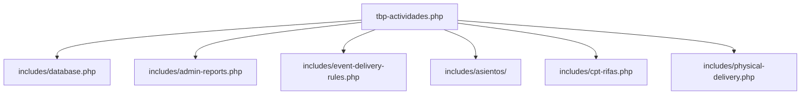

# Documentación Técnica Completa: TBP - Actividades (v11.9.52)

Este documento sirve como memoria técnica, mapa arquitectónico y manual de operaciones del plugin **The Best Prom - Actividades**. Su propósito es resumir todas las funcionalidades, flujos de datos críticos, integraciones con *Event Tickets Plus* y ganchos de WooCommerce para guiar futuras iteraciones sin pérdida de contexto.

---

## 1. Arquitectura y Módulos Principales

El plugin se estructura en módulos especializados ubicados en la carpeta `includes/`:



*   **`tbp-actividades.php`**: Inicialización del plugin, carga de dependencias, hooks generales de WordPress y rutinas de reparación/migración de la base de datos.
*   **`includes/database.php`**: Declaración de la estructura de tablas para el registro de entregas y transacciones locales.
*   **`includes/admin-reports.php`**: Motor del reporte administrativo general del lado del servidor (DataTables AJAX) y motor de exportación en CSV.
*   **`includes/event-delivery-rules.php`**: Gestión de reglas de entrega de paquetes por fechas e IDs de producto, incluyendo el control y validación de check-ins mediante QR.
*   **`includes/cpt-rifas.php` y `cpt-premiaciones.php`**: Definición de Custom Post Types y metadatos para administrar sorteos, asignación de boletos a la tómbola y premiaciones estudiantiles.
*   **`includes/asientos/`**: Motor avanzado de asignación grupal de asientos (Fase 2) basado en algoritmos de empaquetado (Bin-Packing) para organizar mesas.
*   **`includes/physical-delivery.php` y `physical-management.php`**: Shortcodes e interfaces front-end para que los operadores entreguen paquetes y los alumnos consulten su historial en *My Account*.

---

## 2. Reporte General de Actividades (Server-Side)

El reporte administrativo (`admin-reports.php`) está optimizado para tiendas con alto volumen de pedidos (+13,000 registros).

### 2.1 Paginación Rápida e Integración con HPOS
WooCommerce utiliza HPOS (High-Performance Order Storage). Para evitar que consultas pesadas a través de `wc_get_orders()` generen tiempos de espera (Gateway Timeout 504), se implementó una arquitectura híbrida:
1. **Filtro Rápido a Nivel SQL**: Se consultan únicamente los IDs de pedidos relevantes mediante consultas directas y ligeras a la base de datos.
2. **Paginación en PHP**: Se realiza una segmentación del arreglo de IDs (`array_slice()`) en PHP según los parámetros `start` y `length` enviados por DataTables.
3. **Carga Individual**: Solo se instancian como objetos (`wc_get_order()`) los pedidos que se mostrarán en la página actual (normalmente 25 o 50 registros), garantizando compatibilidad absoluta con HPOS y un rendimiento ultrarrápido.

### 2.2 Filtro Defensivo de Desplazamiento (Paginación Vacía)
DataTables en el navegador a veces guarda en memoria la página seleccionada (por ejemplo, página 120). Si el administrador aplica un filtro restrictivo (como "Pendientes de Entrega"), el total de filas se reduce drásticamente.
*   **Solución**: El backend intercepta el parámetro `start` (offset). Si `start` supera el total de registros filtrados, el servidor restablece automáticamente `start = 0` (página 1), evitando que la tabla se muestre completamente vacía.

### 2.3 Segregación de Paquetes vs. Rifas (v11.9.43)
Para evitar que se mezclen registros en los listados:
*   **Solo Paquetes**: Excluye los pedidos que solo contienen boletos de rifa pura (identificados mediante relaciones en `tbp_rifas` y exclusiones SQL).
*   **Solo Rifa**: Excluye los pedidos de paquetes puros.
*   **Renderizado Dinámico**: Las columnas de cantidad (`$qty_val`) e insignias de tipo (`PAQUETE` / `RIFA`) se calculan y muestran respondiendo dinámicamente al filtro de tipo activo (`$f_type`), tanto en la pantalla del administrador como en la exportación a CSV.

---

## 3. Flujo del Escáner QR e Integración con Event Tickets

El plugin intercepta el flujo de registro de la App oficial de *Event Tickets* (Tribe) para adaptarlo a las reglas de negocio de la preparatoria/evento.

```
[Escaneo QR con App] ──> [rest_api_init] ──> (Inyección wc-processing)
                                 │
                                 ▼
                     [CheckIn_Stati.php Hook] ──> (Permitir check-in de processing)
                                 │
                                 ▼
                     [Attendee Check-in Hook] ──> (Detección de Reglas y Fallbacks)
                                 │
                                 ▼
                    [Control de Unidades QR] ──> (Si restan: Revertir check-in en ET+)
```

### 3.1 Intercepción Temprana de la API REST (wc-processing)
La aplicación móvil oficial de *Event Tickets* exige de forma predeterminada que los asistentes tengan pedidos en estado `wc-completed`.
*   **El Problema**: Los pedidos pagados con tarjeta de crédito en la plataforma entran en estado `wc-processing` (etiquetado internamente como `[Pagado con Tarjeta]`), por lo que no se listaban ni se podían escanear en la app.
*   **La Solución**: En `tbp-actividades.php`, se intercepta la petición REST (`rest_api_init`). Si la App solicita asistentes con `order_status=wc-completed`, el plugin reescribe el parámetro global `$_GET['order_status']` inyectando forzosamente `wc-processing`. Esto engaña a la aplicación móvil y hace que cargue todos los boletos pagados en línea.

### 3.2 Habilitación de Check-in en Estado Procesando
Event Tickets Plus valida el estado del pedido al momento del escaneo dentro de `CheckIn_Stati.php` (restringido nativamente a `completed`).
*   **Solución**: Se utiliza el filtro `event_tickets_attendees_woo_checkin_stati` para añadir `processing` a los estados autorizados de check-in, permitiendo que la lectura del QR sea exitosa para pedidos procesando y bloqueándola para pedidos con saldo pendiente (`wc-p-pagado`).

### 3.3 Regla de Respaldo por ID de Producto
Las entregas se rigen por "Reglas de Entrega" configuradas para fechas específicas. Si no hay una regla configurada para el día del evento:
*   **Solución**: Al escanear un boleto, el sistema extrae el ID de producto. Si hoy no coincide con ninguna fecha de regla, busca la regla correspondiente por la asociación del ID del producto y registra la entrega bajo esa regla de respaldo. Esto evita el mensaje de "Ignorado: No hay regla activa para hoy" durante los días de entrega real.

### 3.4 Control de Escaneos Múltiples (Entregas Parciales)
Si un alumno compra múltiples boletos/paquetes en una sola línea del pedido (ej. "3 pases de acompañante"):
*   **Solución**:
    1. Al escanear el QR, el sistema registra la entrega de exactamente `1` unidad.
    2. Se inserta un log en la base de datos y una nota en el pedido de WooCommerce (ej. "Escaneo 1 de 3").
    3. Si el total de unidades entregadas es menor al total comprado, el plugin **anula y revierte inmediatamente el check-in en Event Tickets**. Esto reactiva el código QR para que la app móvil pueda escanearlo nuevamente para los siguientes acompañantes.
    4. Cuando se escanea la última unidad (ej. "3 de 3"), el check-in no se revierte y el boleto se bloquea de manera definitiva.

---

## 4. Estructura de Datos Personalizada (Base de Datos)

El plugin registra y audita todas las entregas físicas en tablas dedicadas:

### 4.1 Tabla `tbp_entregas_fisicas`
| Campo | Tipo | Descripción |
| :--- | :--- | :--- |
| `id` | BIGINT | Clave primaria autoincrementable. |
| `order_id` | BIGINT | ID del pedido de WooCommerce. |
| `item_id` | BIGINT | ID del ítem de la orden (para diferenciar productos del mismo pedido). |
| `product_id` | BIGINT | ID del producto entregado. |
| `delivery_type` | VARCHAR | Tipo de registro (`delivery_items`, `qr_delivery`, `raffle`, `tombola`). |
| `qty` | INT | Cantidad entregada en la transacción. |
| `staff_id` | BIGINT | ID del operador (o ID del asistente/ticket CPT en registros QR). |
| `rule_id` | VARCHAR | ID de la regla de entrega bajo la cual se registró. |
| `created_at` | DATETIME | Marca de tiempo del registro. |

---

## 5. Sincronización Bidireccional de Check-Ins y Logs

Para asegurar la integridad de los datos entre WooCommerce y Event Tickets:
*   **Anulación en Event Tickets**: Si un administrador cancela el registro (Undo Check-In) desde el backend de asistentes de Event Tickets o la App móvil, se dispara el gancho de sincronización que localiza y borra el log de entrega física correspondiente en WooCommerce, deduciendo la cantidad entregada.
*   **Borrado en WooCommerce**: Si un administrador borra un log de entrega QR en el metabox del pedido de WooCommerce (icono de papelera 🗑️), el plugin utiliza las clases de Tribe para cambiar el estado del asistente correspondiente a "no registrado", reactivando su código QR.

---

## 6. Historial de Reparaciones (Scripts de Migración de Datos)

El plugin incluye rutinas automáticas (`admin_init`) para migrar y reparar metadatos dañados en la base de datos:
*   **v1 y v2**: Migración de logs antiguos de fases a la nueva estructura de la base de datos.
*   **v3**: Depuración de desfases de stock y estados fantasmas.
*   **v4**: Escanea logs de tipo manual (`delivery_items`) y QR (`qr_delivery`) para restaurar de forma masiva los metadatos `_tbp_entrega_paquetes = '1'` y `_tbp_delivery_rule_id` de los pedidos entregados históricamente.

> [!IMPORTANT]
> Estas rutinas se ejecutan en lotes indexados utilizando `LEFT JOIN` para evitar la sobrecarga y el agotamiento de memoria del servidor PHP (White Screen of Death).

---

## 7. Consejos para el Desarrollo Futuro

> [!TIP]
> * **HPOS**: Nunca consultes metadatos de pedidos utilizando consultas SQL directas a `wp_postmeta` sin contemplar la tabla de pedidos HPOS de WooCommerce (`wp_wc_orders_meta`). Prioriza el uso de las APIs oficiales de WooCommerce (`$order->get_meta()`, `$order->update_meta_data()`) para garantizar que la base de datos se mantenga íntegra.
> * **Timezones**: Al depurar reglas por fecha, recuerda que WordPress maneja la hora local mediante la configuración del sitio, mientras que la base de datos y ciertos servidores usan UTC. Utiliza la lógica de matriz de zona horaria implementada en `event-delivery-rules.php` para evitar falsos negativos por desfases horarios.

---

## 8. Módulo de Asignación de Asientos (Mesas y Planos)

Este módulo gestiona la asignación y distribución de asientos físicos para eventos mediante un plano visual interactivo y algoritmos de empaquetado.

### 8.1 Tablas de Base de Datos
*   **`tbp_seat_configurations`**: Almacena las configuraciones de asignación por evento, incluyendo el campo que agrupa asistentes (`group_field`) y la configuración serializada de zonas.
*   **`tbp_seat_tables`**: Representa las mesas del evento. Almacena su zona, número, capacidad total y usada, tipo geométrico (`round`, `rectangular`, etc.), coordenadas visuales (`pos_x`, `pos_y`), dimensiones y color.
*   **`tbp_seat_assignments`**: Registra qué pedidos de WooCommerce están asignados a qué mesas, con la cantidad de plazas reservadas y el nombre del comprador.
*   **`tbp_seat_group_zones`**: Permite anular zonas y forzar la asignación de grupos específicos a zonas particulares.
*   **`tbp_seat_elements`**: Almacena elementos decorativos del plano visual (Escenario, Pista de baile, Baños, Salidas de emergencia, etc.) con sus coordenadas y dimensiones.

### 8.2 Interfaz de Administración y Flujo en 3 Etapas
1.  **Etapa 1: Configuración de Metadatos**: El administrador define qué campo del boleto agrupa a los asistentes (ej. "Carrera" o "Grupo") y puede configurar zonas con prioridades y reglas de tamaño de grupo.
2.  **Etapa 2: Procesamiento del Plano (Visual)**: Editor interactivo basado en Canvas HTML5 que permite arrastrar, soltar, redimensionar y configurar formas/bloqueos de mesas y elementos decorativos en tiempo real.
3.  **Etapa 3: Generación y Asignación**:
    *   **Escaneo de Asistentes**: Extrae en lotes los pedidos activos y calcula la cantidad de asientos/platillos requeridos de forma eficiente mediante transients de caché, previniendo cuellos de botella y errores 504.
    *   **Asignación Inteligente (Automática)**: Algoritmo de empaquetado unidimensional (First Fit Decreasing) que acomoda automáticamente a los grupos en las mesas correspondientes a su zona respetando bloqueos y capacidades.
    *   **Asignación Manual**: Modal interactivo a pantalla completa con vista dividida: un panel izquierdo con la cola de pedidos pendientes de acomodo (con barra de progreso animada) y un panel derecho con el plano visual interactivo. Al hacer clic en una mesa, el sistema la llena automáticamente con los pedidos seleccionados de la cola. Soporta deselección masiva, pila de deshacer de asignaciones previas, zoom interactivo y persistencia segura en base de datos.
